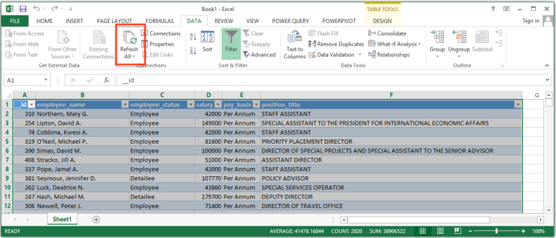
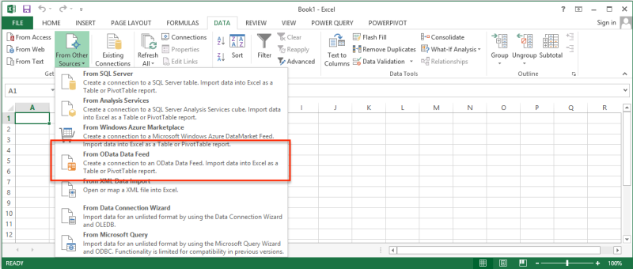
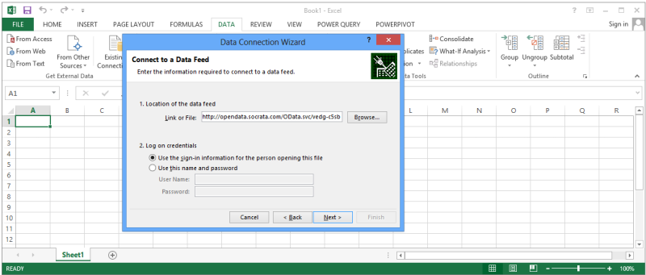
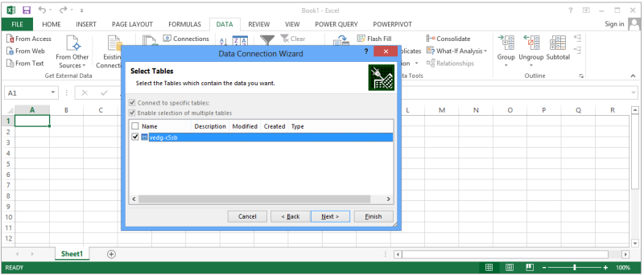
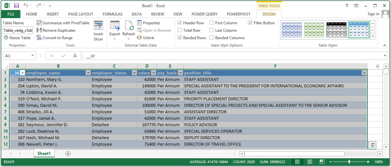
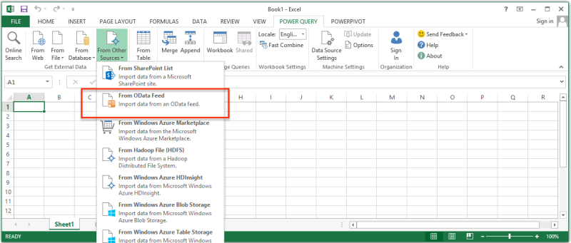
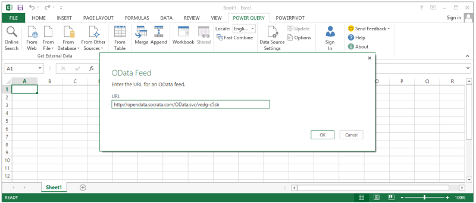
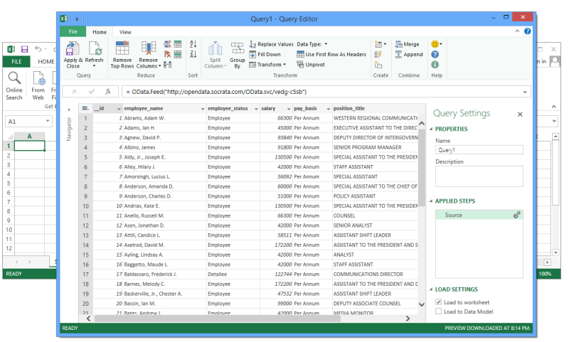
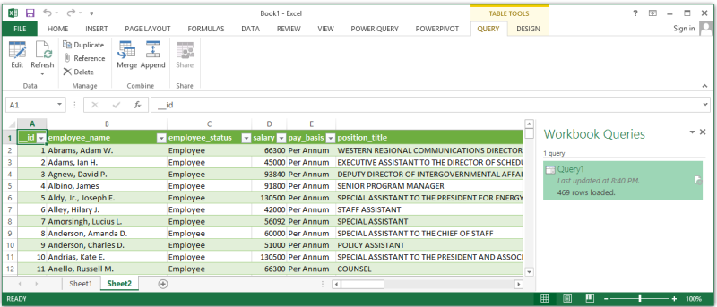

Microsoft Excel is a very popular tool for analyzing and visualizing data. Follow these instructions to create an Excel workbook with a link to data from any Socrata-powered website. 

Because Excel maintains an active link to the data, all you need to do to refresh your workbook with the latest data is click the "Refresh All" button in the Excel ribbon. 

### You will need the dataset's OData endpoint. 

Every dataset has a unique OData endpoint. When viewing a dataset select the "Export" pane and choose the OData section. Copy the OData endpoint to your clipboard. 

Alternatively, the OData endpoint can be created via this simple rule: 

<code class="url">
    http://$domain/OData.svc/$dataset_identifier
</code>

For example, the endpoint for the [White House Visitors Record](http://replaceme.com/url) dataset would be:

<code class="url">
    http://explore.data.gov/OData.svc/644b-gaut
</code>

### Creating a link to the dataset in Microsoft Excel

Note: OData connections are supported starting in the 2010 version of Microsoft Excel.

#### Step 1: Select the "Data" ribbon

Choose to "Get External Data" "From Other Sources" "From OData Data Feed" 

#### Step 2: Paste the OData endpoint link into the dialog box that appears and click "Next"

#### Step 3: Check the box next to the dataset's ID and click "Finish"

*Result:* Your data will appear in a table in Excel

### Accessing Socrata data using Power Query for Microsoft Excel

Power Query for Microsoft Excel provides more querying capabilities than Excel's default Data tab. Here's how you can use Power Query to create a link to a Socrata dataset. 

#### Step 1: Install the Power Query add-in

As of the publication date of this guide (2014-02-05), Microsoft Power Query is not generally available, but you can [find preview builds of Power Query](http://www.bing.com/search?q=download+power+query) provided by Microsoft.

#### Step 2: Select the "Power Query" ribbon

Choose to "Get External Data" "From Other Sources" "From OData Feed" 

#### Step 3: Paste the OData endpoint link into the dialog box that appears and click "Ok"

#### Step 4: Shape the data using Power Query

Note that you will want to use the column header to expand complex types like Locations and Website URLs. When finished, click Apply and Close. 

*Result:* Your data will appear in a table in Excel

### Querying using OData

You can also directly query Socrata data using OData as a REST API.Socrata datasets follow the OData URI Conventions documented in [http://www.odata.org/documentation/uri-conventions](http://www.odata.org/documentation/uri-conventions). For more information on OData, see [http://www.odata.org/introduction](http://www.odata.org/introduction)

Here are some examples of how to apply these conventions to a Socrata catalog and dataset:

List all the datasets available for a domain.

    https://sandbox.demo.socrata.com/OData.svc

Retrieve all the items in a particular dataset.

    https://sandbox.demo.socrata.com/OData.svc/nimj-3ivp

Retrieve one item, by identifier

    https://sandbox.demo.socrata.com/OData.svc/nimj-3ivp(16)

Retrieving a particular field within the item

    https://sandbox.demo.socrata.com/OData.svc/nimj-3ivp(16)/depth/$value 

The OrderBy Query option

    https://sandbox.demo.socrata.com/OData.svc/nimj-3ivp?$orderby=magnitude

The Top Query option

    https://sandbox.demo.socrata.com/OData.svc/nimj-3ivp?$top=2

The Skip Query Option

    https://sandbox.demo.socrata.com/OData.svc/nimj-3ivp?$skip=1005

The Filter Query Option

    https://sandbox.demo.socrata.com/OData.svc/nimj-3ivp?$filter=magnitude%20gt%205

The Select Query Option

    https://sandbox.demo.socrata.com/OData.svc/nimj-3ivp?$select=magnitude,depth

The InlineCount Query Option

    https://sandbox.demo.socrata.com/OData.svc/nimj-3ivp?$filter=magnitude%20gt%205&$inlinecount=allpages

### Socrata Datatypes exposed as OData

This table lists the OData types used to represent Socrata data.  

|Socrata Datatype|ODataDatatype|
|---|---|
|Checkbox|Edm.Boolean|
|Date & Time|Edm.DateTime|
|Date & Time (with timezone)|Edm.DateTimeOffset|
|Document|Complext type with Edm.String listing the URL to the document and Edm.String listing the name of the document|
|Email|Edm.String|
|Location|Complex type with Edm.Decimal for latitude/longitude and Edm.String for Address, City, State and Zip|
|Money|Edm.Decimal|
|Multiple Choice|Edm.String|
|Number|Edm.Decimal|
|Percent|Edm.Decimal|
|Phone|Complext type with Edm.String listing the phone number and Edm.String listing the phone type|
|Photo|Edm.String listing the URL to the photo|
|Text (Formatted)|Edm.String with HTML tags|
|Text (Plain)|Edm.String|
|Website URL|Complex type with Edm.String listing the URL and Edm.String listing the description|
 
Four datatypes are not exposed via OData. These are: Star, Flag, Nested Table and Dataset Link.

### Release Notes - February 2014

* `DateTimeZone` filters using "before", "after", "between" in the Power Query editor will yield an error.
* Pulling the entire opendata.socrata.com catalog is not supported because this domain has too many datasets. Linking to a dataset directly using the Data ribbon in Excel will work.  
